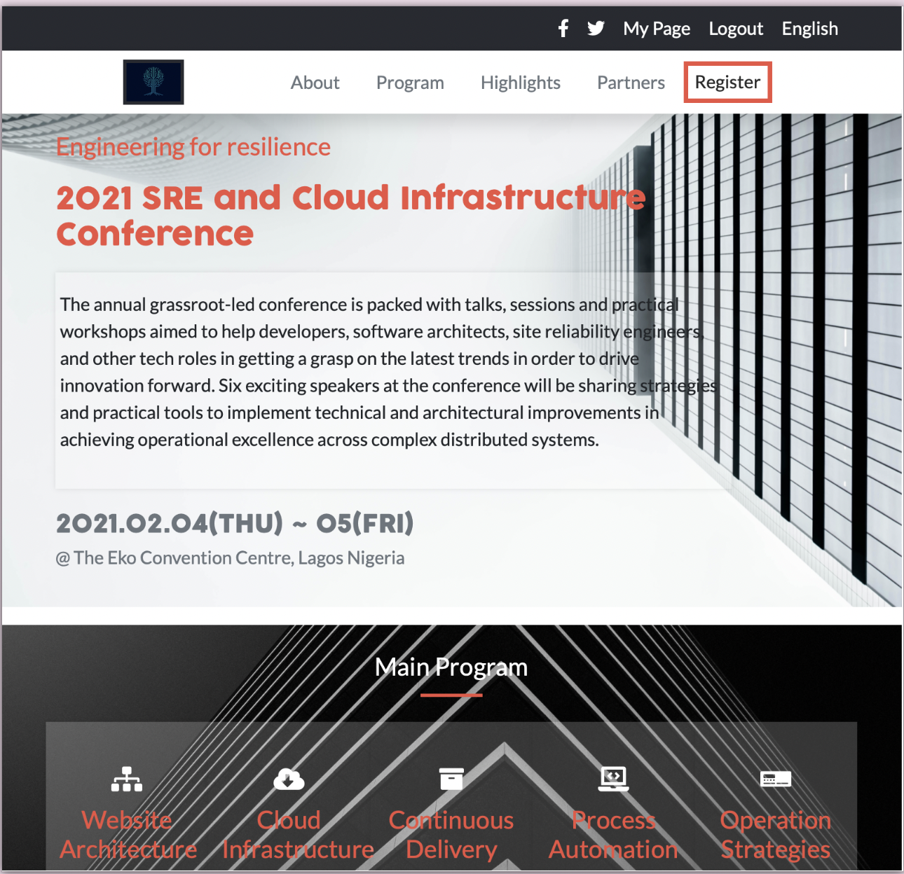
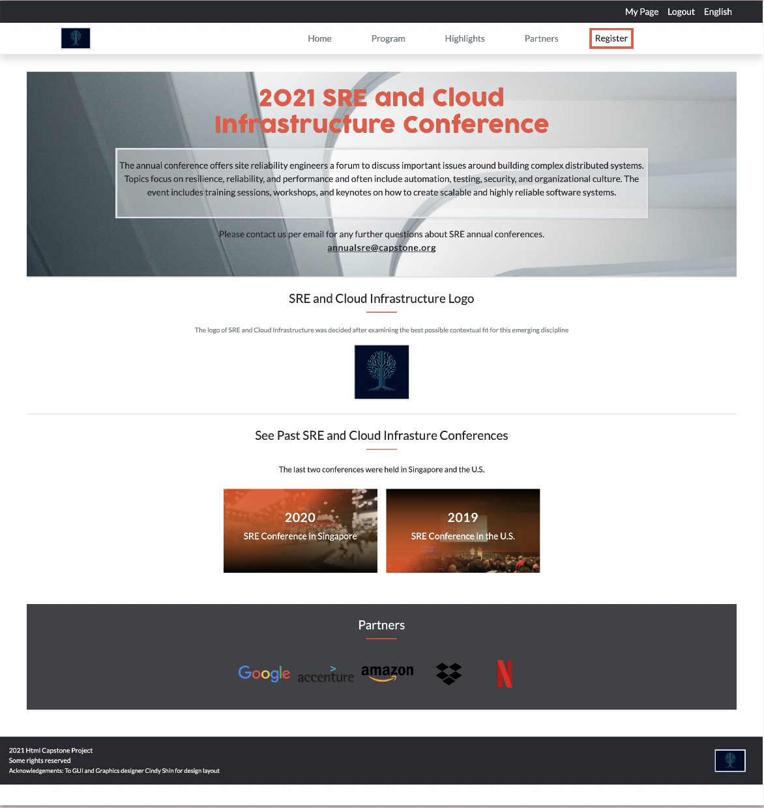
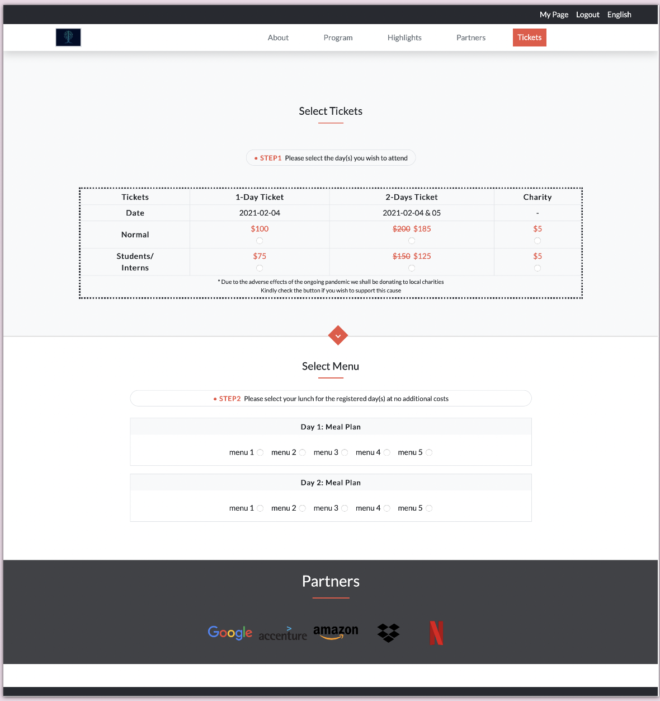

# HTML/CSS Capstone Project

> The project is based on an [online website](https://www.behance.net/gallery/29845175/CC-Global-Summit-2015) for a conference.

## Built With

- Bootstrap 5
- HTML5
- CSS

## Live Demo

[Live Demo Link](https://livedemo.com)

👤 **Author**

- GitHub: [@george-swift](https://github.com/george-swift)
- Twitter: [@\_\_pragmaticdev](https://twitter.com/__pragmaticdev)

## 🤝 Contributing

Contributions, issues, and feature requests are welcome!

## Show your support

Give a ⭐️ if you like this project!

## Acknowledgments

- Hat tip to the following:
  - GUI and Graphics Designer Cindy Shin; creative behind the [original design](https://www.behance.net/gallery/29845175/CC-Global-Summit-2015) on Behance
  - Unsplash for contextual images

## 📝 License

This project is [MIT](https://www.mit.edu/~amini/LICENSE.md) licensed.
